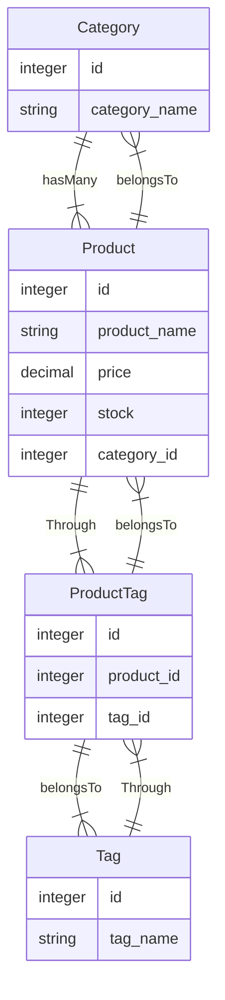

# E-commerce Back End 

Internet retail, also known as e-commerce, is the largest sector of the electronics industry, having generated an estimated US$29 trillion in 2017 (Source: United Nations Conference on Trade and Development). E-commerce platforms like Shopify and WooCommerce provide a suite of services to businesses of all sizes. Due to the prevalence of these platforms, developers should understand the fundamental architecture of e-commerce sites.

   

# Table of contents
* [Purpose](#purpose)
* [Usage](#user-story)
* [Technologies Used](#technologies-used)
* [Run Instructions](#run-instructions)
* [Test Instructions](#test-instructions)
* [More Information](#more-information)
* [Contributors](#contributors)
* [License](#license)

## Purpose
To build the back end for an e-commerce site.

## User Story
   AS A manager at an internet retail company
    I WANT a back end for my e-commerce website that uses the latest technologies
    SO THAT my company can compete with other e-commerce companies

## Technologies Used
- Java Script
- NodeJs (Inquirer for command prompt)
- Mysql2
- Sequalize (ORM)

Object-relational mapping (ORM) is a technique that allows developers to convert data between incompatible type systems using object-oriented programming principles. This will allow to set up and completely manage objects using JavaScript, while Sequelize translates your code into database schema and queries using SQL.

## Run Instructions
npm start

## Test Instructions
Please refer [here for insomania collection](./Assets//Insomnia_collection) to test all rest calls of this application

Please refer below a walkthrough videos of test runs of deployed application:

https://user-images.githubusercontent.com/38411252/155857818-1dc83283-88be-4fe5-b558-155b3658315c.mp4

 
https://user-images.githubusercontent.com/38411252/155857834-e21277bf-2734-4633-bd47-eb5a16a8a352.mp4

https://user-images.githubusercontent.com/38411252/155857838-e2a86ab1-f785-448a-8039-3fa793f10e47.mp4

https://user-images.githubusercontent.com/38411252/155857859-f0d7a8d9-d100-4cd0-9126-68a6498eb1ea.mp4

## More Information
  Please find below acceptance criteria of project:

    GIVEN a functional Express.js API
    WHEN I add my database name, MySQL username, and MySQL password to an environment variable file
    THEN I am able to connect to a database using Sequelize
    WHEN I enter schema and seed commands
    THEN a development database is created and is seeded with test data
    WHEN I enter the command to invoke the application
    THEN my server is started and the Sequelize models are synced to the MySQL database
    WHEN I open API GET routes in Insomnia for categories, products, or tags
    THEN the data for each of these routes is displayed in a formatted JSON
    WHEN I test API POST, PUT, and DELETE routes in Insomnia
    THEN I am able to successfully create, update, and delete data in my database

### Database Design

### Wiremock

## Contributors
Krupali

## License
Please consult the attached LICENSE file for details. All rights not explicitly granted by the MIT,Apache License are reserved by Original Author.    

Copyright (c) 2021